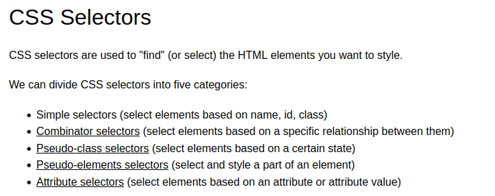
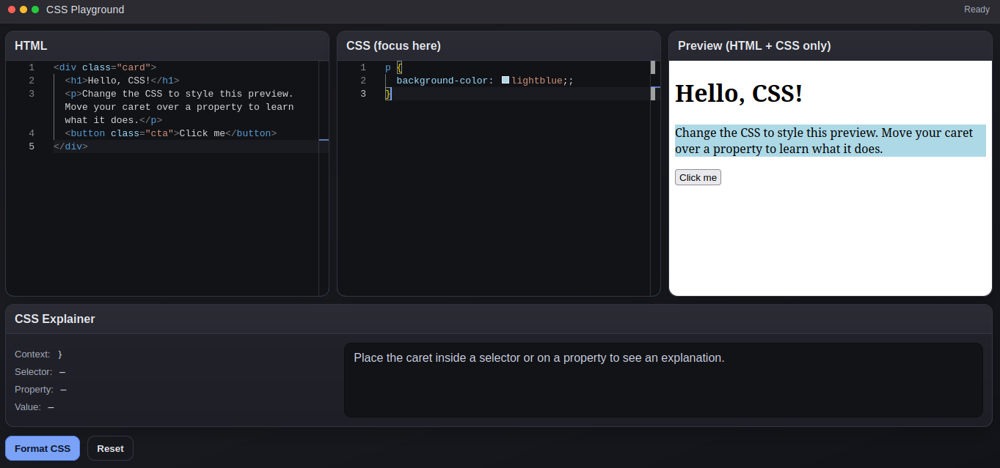
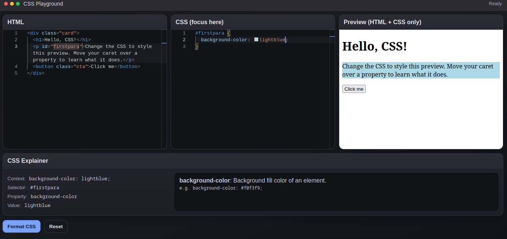
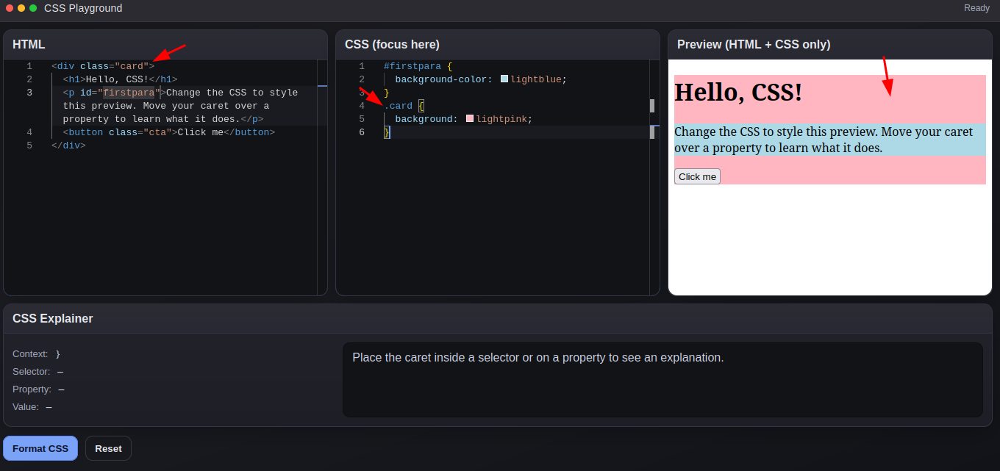
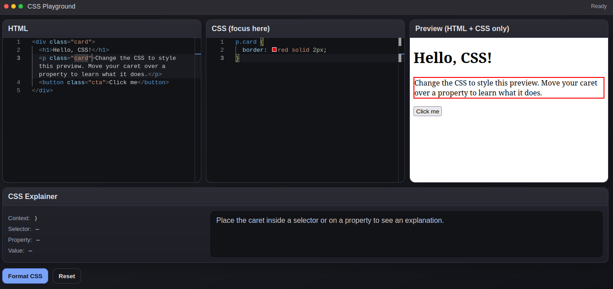
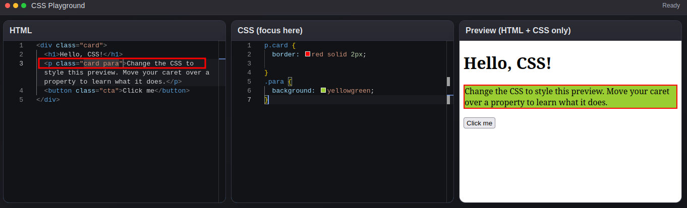
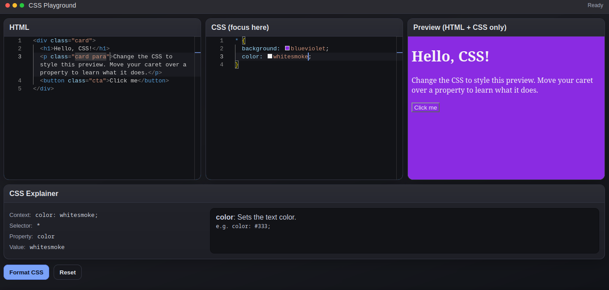
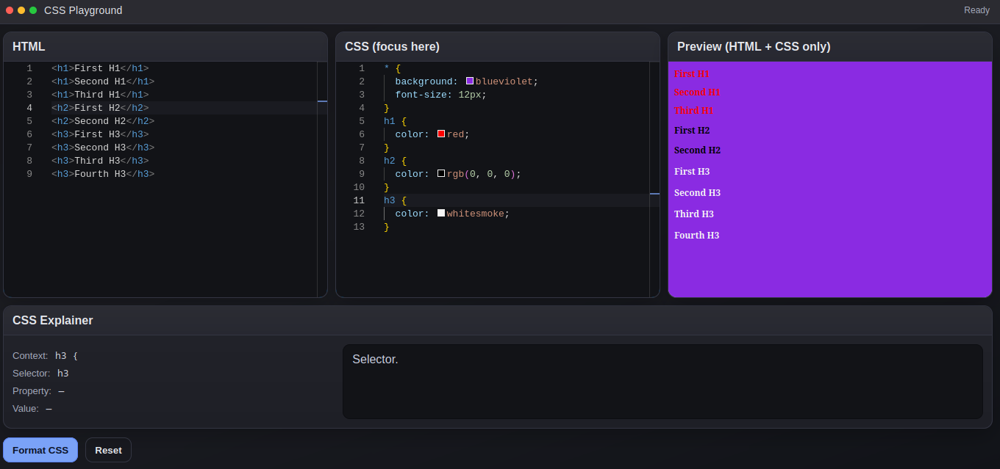

Element Selector: Slect with element name

ID selector with #: inside the tag element create id="idname" then select that element with #idname

Class Selector with dot (.): name class inside the tag element then select them with dot(.)

select specific class when there is same class name for multliple element

multiple class name can be named at the same time 

Universal selector with wildcard sign (*)

Grouping selector 

